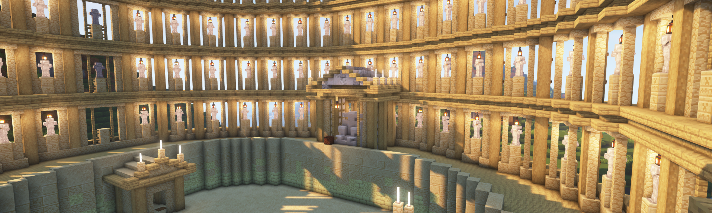

# Colloseum

##### Warp: `/warp colloseum`

The beautiful colloseum built and designed by [Asher](asher), with the help of [Krafter](krafter), Hooni, Fish, Zero, Endme, ExoGooba, Yuri, Turtle, Oofguy, Egg, Bazil, Banana, and Kaz.

It is a pvp arena with redstone gates at the constestant entrances built by [Krafter](krafter). There is also a hidden gate below the throne to let in monsters (also built by Krafter). It is used to settle disputes, make bets, and general entertainment. The land is also owned by [Krafter](krafter), but [Asher](asher) is also an admin for the claim.