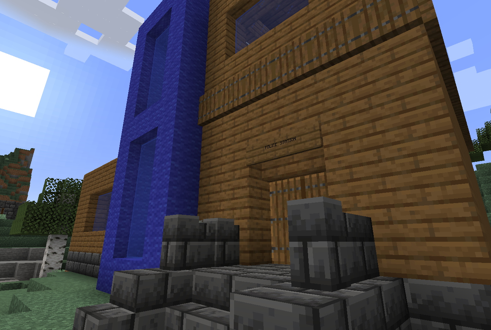

# Police Station

##### Warp: `/warp policestation` 

The police station is in charge of catching criminals so they can pay for their crimes after a fair trial in the [Court](court).

It is operated by [1_Guy](1-guy), the Cheif of Police, and [AwesomeNinjaBoy9](awesomeninjaboy9), the Second in charge. 